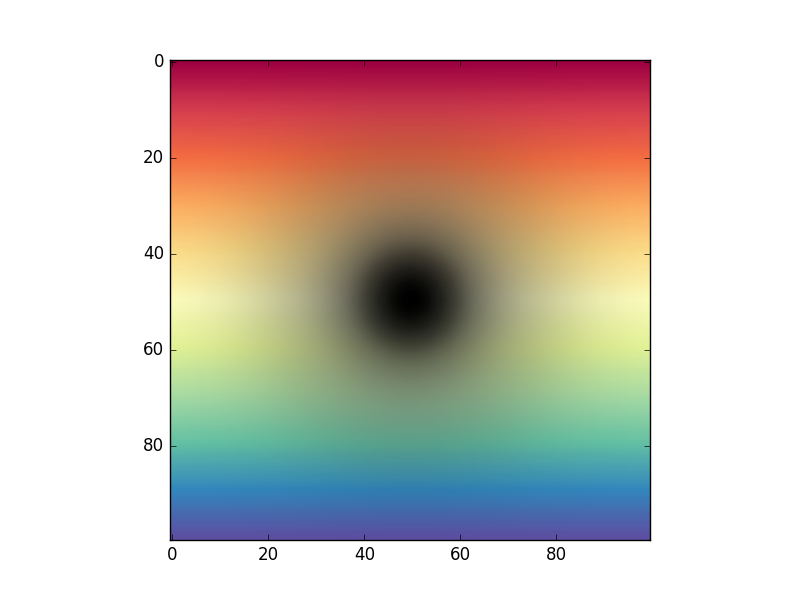

# Overview

This is a simple wrapper around matplotlib's `imshow` function, which 
allows to produce images with **pixel-dependent transparency**. This can
be particularly useful to **overlay** several images.

The solution implemented was inspired by [this post](http://stackoverflow.com/questions/10127284/overlay-imshow-plots-in-matplotlib).

# Example

Below is a simple example that shows how to overlay two arrays of data,
by using the function `transp_imshow` which is provided in this package.
```python
import numpy as np
import matplotlib.pyplot as plt
from transparent_imshow import transp_imshow

# Create some data
x, y = np.meshgrid( np.linspace(-2, 2, 100), 
                   np.linspace(-2, 2, 100) )
data1 = y
data2 = np.exp( -x**2 -y**2 )

# Plot with transparency
plt.imshow( data1, cmap='Spectral' )
transp_imshow( data2, cmap='Greys' )
```

The code produces the following image:



For more information on the function `transp_imshow`, see its docstring.

# Installation

In order to install this package, clone the code using `git`, and type:
```
python setup.py install
```
